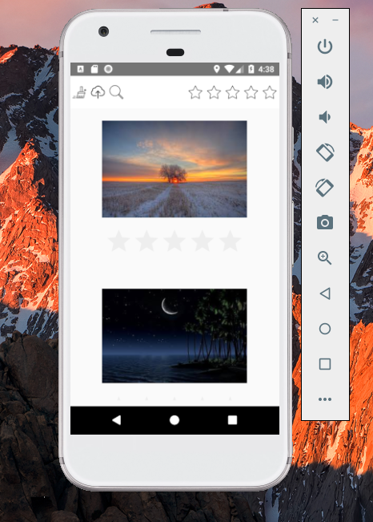
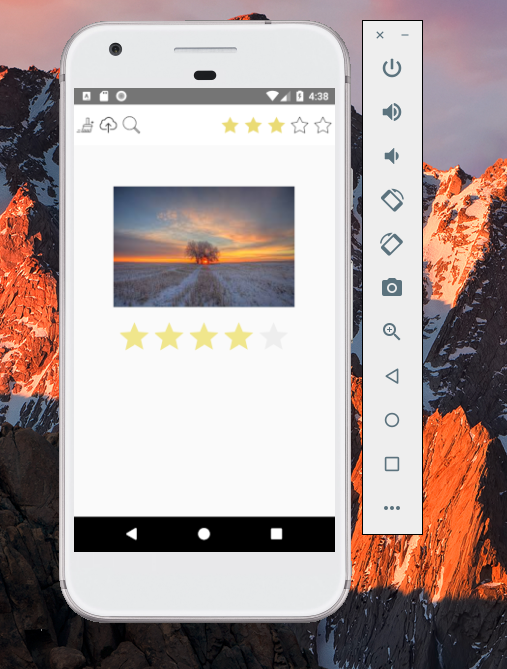
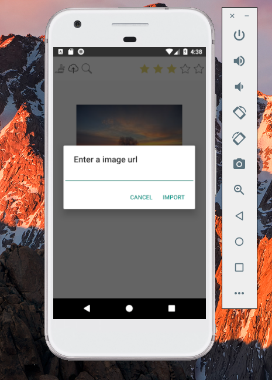

# Fotag Mobile
Fotag Mobile is an interactive mobile application that allows users to load images, and display these images in a dynamic layout that responds to device orientation. Users can rate images (1-5), and filter them based on this rating.

# Dev Environment:
OS: MAC 
JAVA version: 10.0.1
IDE: Android studio
Gradle Version: 4.4
Android Plugin Version: 3.1.3
Compile Sdk version: API 28
Devices: Pixel API 26

# Instruction
1. On Action bar, click the same rating star to clear rating
2. On rating bar on imageView, slide to clear rating

# Screen shots
# Screen shots

